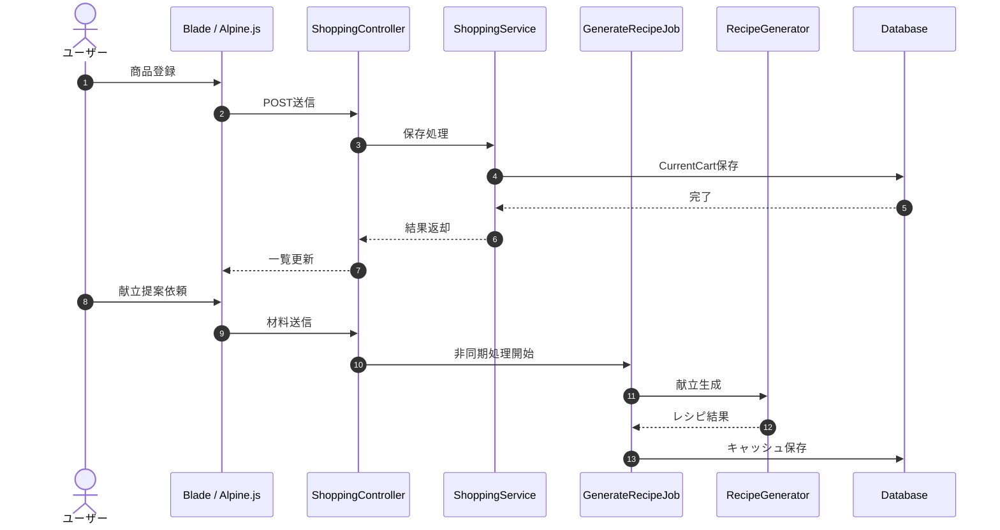
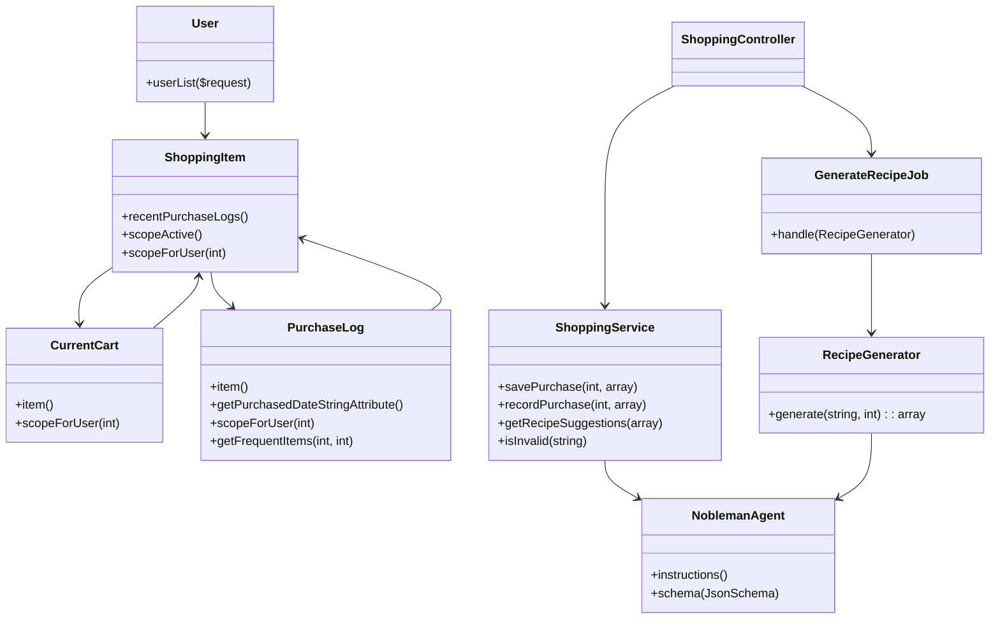

# 消費財購買管理および献立提案システム  

    


  


  


## プロジェクト概要
- Laravel 13 / PHP 8.4 を使用した Web アプリケーション
- Laravel Breeze ベースの認証機能
- ショッピングリスト管理
- 購入履歴管理
- AI 献立提案（非同期ジョブ）
- 管理者ユーザー管理機能

## 学習・検証目的
- Laravel アプリケーション設計の理解
  - Controller に処理を集中させず、Service 層へビジネスロジックを分離する構成を検証。

- 非同期処理の実装経験
  - Laravel Queue / Job を利用し、AI処理など時間のかかる処理をバックグラウンド実行する構成を検証。

- AI API連携の検証
  - Laravel AI SDK を利用し、AI Agent による構造化レスポンス取得とアプリケーション連携を実装。

- Docker 開発環境の構築
  - WSL2 + Docker Compose を利用し、アプリケーション開発環境をコンテナ内で完結させる構成を検証。  

## 技術選定の背景
- Laravel 13 & PHP 8.4: 型安全性と最新の言語機能を最大限に活用し、長期的なメンテナンス性を確保するため。
- Docker/WSL2: 開発者ごとに環境が差異が出ないよう、完全に分離・再現可能な開発インフラを構築。
- Service Layer Pattern: ビジネスロジックの肥大化を防ぎ、テスト容易性と可視性を高めるための建築的選択

## 主な機能
- 認証フロー
  - ログイン、ログアウト、登録、パスワードリセット、メール認証（`routes/auth.php`）
- ショッピングリスト管理
  - 商品をカート（`CurrentCart`）に追加
  - 既存アイテムの編集、削除
- 購入処理と履歴保存
  - カートから購入完了を記録して `PurchaseLog` に保存
  - 購入履歴を日付ごとにグループ化して取得
  - よく購入する商品を集計して取得
- AI 献立提案
  - `ShoppingController::suggest` で材料入力を受け取り、`GenerateRecipeJob` をキューに投入
  - `RecipeGenerator` が `NoblemanAgent` を使って AI から構造化出力を取得
  - ジョブ結果をキャッシュに保持し、`ShoppingController::getRecipeStatus` で進捗/完了を返却
- 管理者権限の gate 定義
  - `AppServiceProvider` で `admin` gate を定義
  - `admin` ミドルウェア付きで `UserController` のルートを保護
- 管理者向けのユーザー管理機能
  - ユーザー削除
- プロフィール管理
  - プロフィール編集、メール再認証処理、アカウント削除

## 使用技術
| カテゴリ | 使用技術 |
| :--- | :--- |
| **Backend** | Laravel 13, breeze, Pest, PHP_CodeSniffer |
| **Frontend** | Tailwind CSS, Node.js, Alpine.js |
| **AI** |Laravel AI / Gemini（AI SDK） |
| **Infrastructure** | Docker Compose (App / Node / MySQL / Nginx) |
| **OS Environment** | WSL2 (Ubuntu / Alpine Linux) |
| **Database** | MySQL 8.x |

## セットアップ手順

### 1. インフラのビルドと起動
```
docker compose build
docker compose up -d
```

### 2. バックエンド初期化
```
docker compose exec app ash
composer create-project laravel/laravel example
chown -R www-data:www-data storage bootstrap/cache
chmod -R 775 storage bootstrap/cache
```
#### 3. PHPUnit削除
```
composer remove phpunit/phpunit --dev
./vendor/bin/pest --init
```
#### 4. 認証基盤インストール
```
composer require laravel/breeze --dev
php artisan breeze:install --dark
```
#### 5. フロントエンド依存関係  
```
npm install
npm run dev
```
※ npm コマンドは Node がインストールされた app コンテナ内で実行しています。
#### 6. マイグレーション
```
php artisan migrate
```
#### 7. その他
```
composer require --dev "squizlabs/php_codesniffer=*"
composer require --dev barryvdh/laravel-debugbar
composer require laravel-lang/lang:~8.0
php artisan lang:publish
cp ./vendor/laravel-lang/lang/json/ja.json ./lang/
cp -r ./vendor/laravel-lang/lang/src/ja ./lang/
composer require blade-ui-kit/blade-heroicons
```
#### 8. AI SDK の導入
```
composer require laravel/ai
php artisan vendor:publish --provider="Laravel\Ai\AiServiceProvider"
```
※Gemini無料枠使用、`.env` ファイルを編集して、データベース接続情報と AI API キーを設定してください。
## ディレクトリ構成（主要部分）
- `compose.yaml` / `docker-compose.yaml` 相当の Docker 定義が存在
- `php/`
  - `Dockerfile`
  - `src/`
    - `app/`
      - `Ai/` - AI エージェント
      - `Enums/` - `ShopType` 等の列挙型
      - `Http/`
        - `Controllers/` - 画面処理とルーティングロジック
        - `Requests/` - バリデーションフォームリクエスト
      - `Jobs/` - 非同期ジョブ
      - `Models/` - Eloquent モデル
      - `Providers/` - サービスプロバイダー
      - `Services/` - ビジネスロジック
    - `config/` - `ai.php` などの設定
    - `database/`
      - `migrations/` - テーブル定義
    - `resources/`
      - `views/` - Blade テンプレート
    - `routes/`
      - `web.php` - アプリケーションルート
      - `auth.php` - 認証ルート
    - `tests/` - Pest による自動テスト
- `nginx/`
  - `default.conf`

## テスト済みの主要機能
- 認証機能
  - 登録、ログイン、ログアウト、メール認証が正常に動作すること

- CRUD操作
  - 商品登録、編集、削除が正常に動作すること

- バリデーション
  - 不正な入力時に適切なエラーが表示されること

- 非同期処理
  - Queueに登録されたJobが正常実行され、AI API呼び出し結果を取得・保存できること

- AI連携
  - AIから取得した構造化レスポンスをアプリケーション側で正しく処理できること

- 認可処理
  - 管理者権限が必要な機能へ一般ユーザーがアクセスできないこと

## 設計・実装の特徴
- Service レイヤー
  - `ShoppingService` と `RecipeGenerator` にビジネスロジックを分離
- Enum 活用
  - `App\Enums\ShopType` によるカテゴリ・アイコン・色の管理
- AI エージェント設計
  - `App\Ai\Agents\NoblemanAgent` が構造化出力スキーマを定義
  - `GenerateRecipeJob` が非同期処理結果を `Cache` に保存
- 管理者認可
  - `AppServiceProvider` で `Gate::define('admin', ...)` を設定
---

## 処理の流れ

## クラス構成図

## 今後の改善予定
- プロトタイプと学習目的での実装なので、Livewireで再実装しそこへ改善点盛り込み予定。