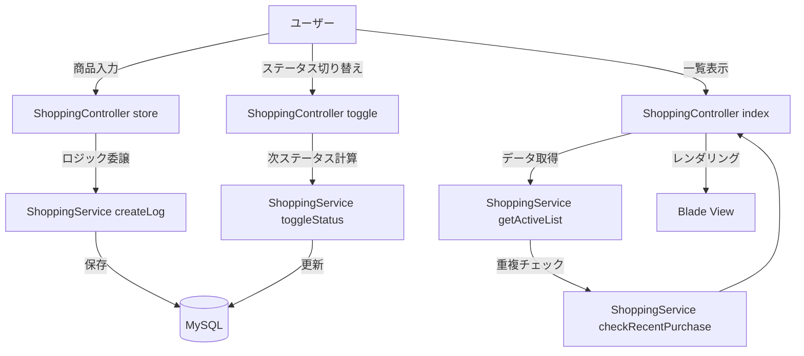
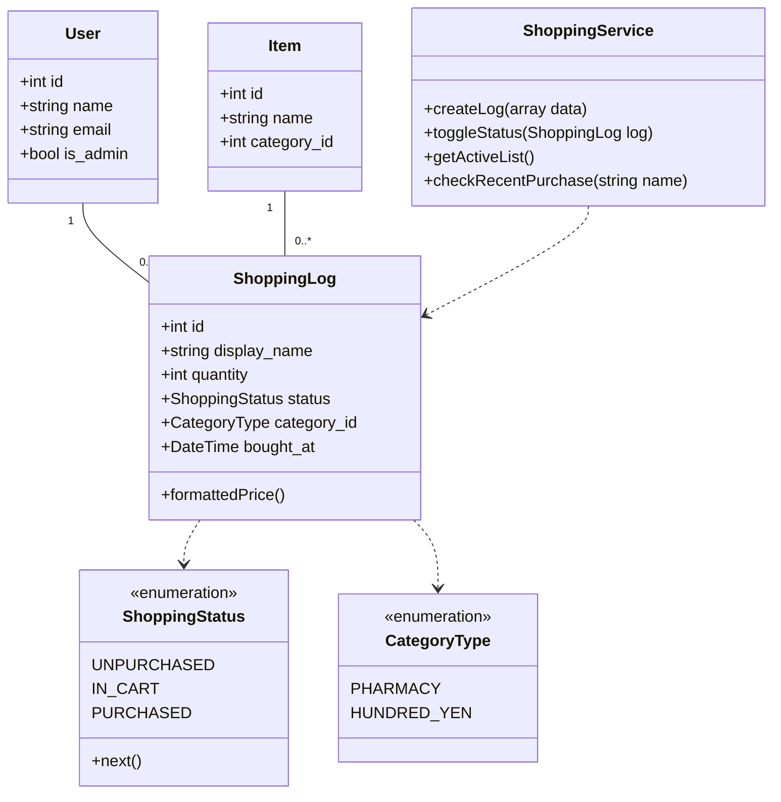

# 消費財購買管理および献立提案システム  

    


  


  


## プロジェクト概要
Laravel 13 と Tailwind CSS を使用した、シンプルでモダンなショッピングリスト管理アプリケーションです。  
日常の買い物を効率化するためのメモアプリです。商品のステータス管理（未購入・カゴ・購入済み）やカテゴリ分け、AIによるレシピ提案（実装中）などの機能を備えています。  
## 学習・検証目的
- モダンな設計パターンの実践: Controller からロジックを分離し、Service クラスに集約する「クリーンな設計」の探究。
- 最新技術スタックの検証: Laravel 13 / PHP 8.4 という最先端環境における堅牢なアプリケーション構築。
- UI/UXの高度化: Tailwind CSS を駆使した、ストレスフリーな動的ユーザー体験の実装。  

## 技術選定の背景
- Laravel 13 & PHP 8.4: 型安全性と最新の言語機能を最大限に活用し、長期的なメンテナンス性を確保するため。
- Docker/WSL2: 開発者ごとに環境が差異が出ないよう、完全に分離・再現可能な開発インフラを構築。
- Service Layer Pattern: ビジネスロジックの肥大化を防ぎ、テスト容易性と可視性を高めるための建築的選択

## 主な機能
- 商品管理:  
	- 商品名、個数、価格、カテゴリを指定してリストに追加
	- 商品の削除
- ステータス管理（トグル機能）: 
	- 「未購入」→「カゴ」→「購入済み」の3段階でステータスを切り替え
	- 購入済みになったタイミングで「購入日」を自動記録
- 重複購入アラート: 
	- 同じ商品を3日以内に購入している場合、警告を表示
- カテゴリ管理: 
	- 薬局、百均、スーパー、その他のカテゴリ分け
	- カテゴリに応じたアイコンの自動切り替え
- ユーザー認証: 
	- Laravel Breeze によるログイン、新規登録、プロフィール管理
- UI/UX理: 
	- ダークモード対応
	- モバイルフレンドリーなレイアウト（Alpine.js 使用）
## 使用技術
| カテゴリ | 使用技術 |
| :--- | :--- |
| **Backend** | Laravel 13, breeze, Pest, PHP_CodeSniffer |
| **Frontend** | Tailwind CSS, Node.js, Alpine.js |
| **AI / External Service** | Gemini API（AI SDK） |
| **Infrastructure** | Docker Compose (App / Node / MySQL / Nginx) |
| **OS Environment** | WSL2 (Ubuntu / Alpine Linux) |
| **Database** | MySQL 8.x |

## セットアップ手順

### 1. インフラのビルドと起動
```
docker compose build
docker compose up -d
```

### 2. バックエンド初期化
```
docker compose exec app ash
composer create-project laravel/laravel example
chown -R www-data:www-data storage bootstrap/cache
chmod -R 775 storage bootstrap/cache
```
#### 3. PHPUnit削除
```
composer remove phpunit/phpunit --dev
./vendor/bin/pest --init
```
#### 4. 認証基盤インストール
```
composer require laravel/breeze --dev
php artisan breeze:install --dark
```
#### 5. フロントエンド依存関係  
```
npm install
npm run dev
```
※ npm コマンドは Node がインストールされた app コンテナ内で実行しています。
#### 6. マイグレーション
```
php artisan migrate
```
#### 7. その他
```
composer require --dev "squizlabs/php_codesniffer=*"
composer require --dev barryvdh/laravel-debugbar
composer require laravel-lang/lang:~8.0
php artisan lang:publish
cp ./vendor/laravel-lang/lang/json/ja.json ./lang/
cp -r ./vendor/laravel-lang/lang/src/ja ./lang/
```
#### 8. AI SDK の導入
```
composer require laravel/ai
php artisan vendor:publish --provider="Laravel\Ai\AiServiceProvider"
```
※Gemini無料枠使用、`.env` ファイルを編集して、データベース接続情報と AI API キーを設定してください。
## ディレクトリ構成（主要部分）
- **`/` (Root)**
    - `docker-compose.yaml` - Docker構成定義
    - **`php/`** - PHP実行環境
        - `Dockerfile` - PHPイメージビルド定義
        - **`src/`** - Laravelアプリケーション本体
            - **`app/`**
                - `Enums/` - カテゴリ・ステータス等の定数定義
                - **`Http/`**
                    - `Controllers/` - ビジネスロジックの制御
                    - `Requests/` - バリデーション
                - `Models/` - DBモデル (Item, ShoppingLog, User)
                - `Services/` - 共通ロジック (ShoppingService)
            - **`database/`**
                - `migrations/` - テーブル設計・スキーマ管理
            - **`resources/`**
                - `views/` - 画面テンプレート (Blade)
            - **`routes/`**
                - `web.php` - ルーティング定義
    - **`nginx/`** - Webサーバー設定
        - `default.conf` - Nginx設定ファイル

## テスト済みの主要機能

- **認証周り**: ログイン、ログアウト、登録処理が正常に動作すること。
- **CRUD操作**: 商品データの登録、編集、削除が管理者権限で正常に行えること。
- **バリデーション**: 不正なデータ入力時に適切なエラーメッセージが表示されること。
- **決済フロー**: Stripe テスト環境を用いた決済処理が完了すること。

## 設計・実装の特徴

実務上の運用フェーズを想定し、高度な認可制御と管理支援機能を実装しています。

- Service パターンの採用
	- `ShoppingService`にビジネスロジック（ステータス遷移や重複チェック）を切り出し、コントローラーを軽量に保っています。
- Enum の活用:ステータスやカテゴリを PHP の Enum で定義し、表示ラベルや CSSクラス、アイコン名の取得ロジックを一元管理しています。
	- 安全性の担保: 管理者のみがアクセスできる決済履歴や、一斉メール送信権限を確実にガードしています。
- コンポーネント指向のフロントエンド
	- Blade Components と動的コンポーネント (`x-dynamic-component`)を活用し、メンテナンス性の高い UI を構築しています。
- 品質保証
	- Pest による網羅的なテスト:
		- Gate による認可の不備がないか（一般ユーザーが管理者機能に触れないか）。
		- Impersonation 時にセッションが正しく切り替わるか。
		- Stripe 連携および勤怠計算ロジックの正確性。
---

## 処理の流れ

## クラス構成図

## 今後の改善予定
- Webhook 連携: Stripe の決済イベントをより詳細にハンドリングし、非同期での在庫管理を強化。
- Pest アーキテクチャテスト: コードの依存関係が崩れないよう、アーキテクチャ自体をテストで縛る。